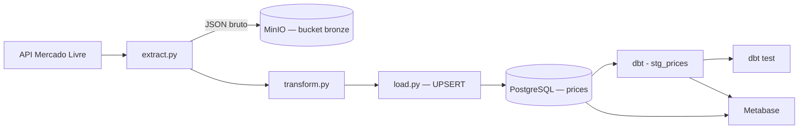

# 🛍️ Price Tracker — Pipeline ELT (Mercado Livre)

Pipeline de dados que extrai preços de produtos da API pública do Mercado Livre, guarda o dado bruto em um Data Lake, carrega de forma idempotente em um Data Warehouse e aplica transformação e testes de qualidade com dbt. Os dados tratados alimentam dashboards no Metabase.


## 📐 Arquitetura



**Por que ELT, e não ETL?**
O dado bruto é carregado primeiro, sem tratamento — tanto no Data Lake (bucket `bronze` no MinIO) quanto em uma tabela raw no Postgres. A transformação (renomear colunas, tipar, tratar nulos) acontece depois, em SQL, dentro do próprio Data Warehouse, via dbt. Isso preserva o dado original para reprocessamento/auditoria e usa o banco para o trabalho pesado.

**Carga idempotente**
`load.py` não faz um `INSERT` simples. Ele grava os dados em uma tabela temporária e executa um `UPSERT` (`INSERT ... ON CONFLICT (id) DO UPDATE`) na tabela final — rodar o pipeline várias vezes no mesmo dia atualiza os preços existentes em vez de duplicar produtos.

## 🧰 Stack

| Camada | Tecnologia | Papel |
|---|---|---|
| Linguagem | Python 3.9+ | Extração e execução do pipeline |
| Extração | `requests` | Consumo da API pública do Mercado Livre |
| Data Lake | MinIO (S3-compatible) | Armazenamento do dado bruto (camada bronze) |
| Banco de dados | PostgreSQL 15 | Data Warehouse (raw + staging) |
| Transformação | dbt | Modelagem em SQL + testes de qualidade (`unique`, `not_null`) |
| Testes | pytest + pytest-mock | Testes unitários com mock de chamadas HTTP |
| Infraestrutura | Docker Compose | Sobe Postgres, Metabase e MinIO localmente |
| Visualização | Metabase | Dashboards sobre os dados tratados |

> dbt faz **transformação**, não orquestração. Hoje o pipeline roda de forma sequencial (`main.py` → `dbt run` → `dbt test`)

## 📂 Estrutura do projeto

```
ecommerce-price-tracker-pipeline/
├── src/
│   ├── extract.py        # Extração da API + upload para o Data Lake
│   ├── transform.py      # Conversão para DataFrame + timestamp
│   └── load.py           # Carga idempotente (UPSERT) no Postgres
├── tests/
│   └── tests_extract.py  # Testes unitários da extração
├── models/
│   ├── stg_prices.sql
│   └── schema.yml
├── main.py                # Orquestra: extract → transform → load
├── docker-compose.yml     # Postgres + Metabase + MinIO
├── requirements.txt
└── README.md
```

## ▶️ Como executar

**Pré-requisitos:** Docker + Docker Compose, Python 3.9+

**1. Clonar o repositório**
```bash
git clone https://github.com/gadelha-allan/ecommerce-price-tracker-pipeline.git
cd ecommerce-price-tracker-pipeline
```

**2. Configurar variáveis de ambiente** — crie um `.env` na raiz:
```env
# PostgreSQL
DB_USER=postgres
DB_PASS=postgres
DB_NAME=price_tracker
DB_HOST=localhost
DB_PORT=5432

# MinIO (Data Lake)
MINIO_USER=admin
MINIO_PASS=admin123
```

**3. Subir a infraestrutura**
```bash
docker-compose up -d
```
Postgres em `localhost:5432`, Metabase em `localhost:3000`, MinIO em `localhost:9000` (console em `9001`).

**4. Instalar as dependências**
```bash
pip install -r requirements.txt
```

**5. Criar a tabela raw** — o `UPSERT` de `load.py` depende de uma chave única em `id`:
```sql
CREATE TABLE prices (
    id VARCHAR PRIMARY KEY,
    title TEXT,
    price NUMERIC,
    currency_id VARCHAR(10),
    permalink TEXT,
    extracted_at TIMESTAMP
);
```

**6. Testar, rodar o pipeline e o dbt**
```bash
pytest
python main.py
dbt run
dbt test
```

## 🧪 Testes

Cobertura atual: testes unitários de `fetch_data` (extração), com `pytest-mock` simulando a resposta da API — nenhuma chamada real acontece durante o teste. A qualidade dos dados transformados é validada via `dbt test` (`unique`/`not_null` em `product_id` e `price`).
